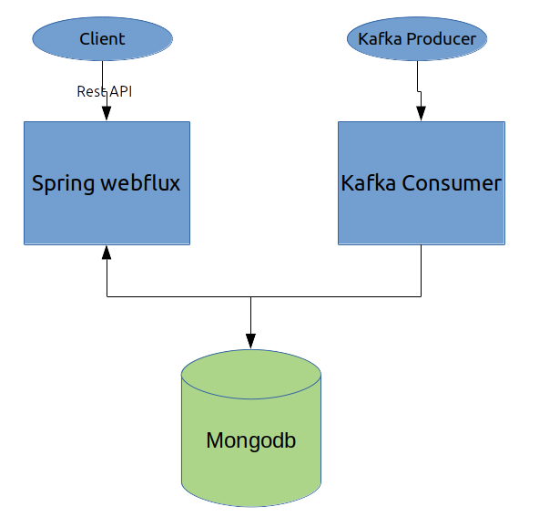

# Consumer Simulator App

Project to simulate IoT sensor procesing events from a Kafka cluster.

## Technologies

- **[Spring Webflux](https://docs.spring.io/spring/docs/current/spring-framework-reference/web-reactive.html)**
- **[Maven](https://maven.apache.org/)** 
- Java 11
- Kafka / Spring cloud stream
- Mongodb / Reactive connector
- Spring security
- lombok


## Getting Started

### Requirements

- Docker
  - Needed in case you want to run it with Docker.
- Java 11
  - Need have the JAVA_HOME set in case you want to execute via Maven

### Building

At the project root folder, execute:

```shell
maven clean package -DskipTests=true
```


#### Run with tests

```shell
maven clean install
```


## Design and Architecture



* Kafka consumer consumes stream from producer and store it in database. In order to implemet that I've been using :

- spring cloud stream because it provides a good abstraction so it makes it easy later to replcae kafka with another platform such as rabbitmq.
- database and IO operations are blocking however, when it comes to streaming non-blocking is better choice so r2dbc mongo connector has been used which provided by spring mongo reactive library


TODOs :

- For making an endpoint secure , http basic mechanism has been used which can be improved by jwt token and auth server implementation. please visit this repo of [mine](https://github.com/jedlab/cloud-platform).
- inmemory hardcoded users should move to a RDBMS (Postgresql)
- handling backpresure : if kafka producers emit items faster than consumer can consume 
- create docker volumes to keep data after docker restart
- more integration/unit tests coverage
- improve exception handling

### Running

Make sure, producer is up and running 


- Run the docker compose file

      ````bash
      docker-compose -f "docker-compose.yml" up --build -d
      ````

- Run without docker

```
java -jar target/consumer-0.0.1-SNAPSHOT.jar
```

cUrl

```
curl -X GET \
  'http://ip:port/consumer-api/sensors/{operation}?fromDate=2022-01-16&toDate=2022-01-20' \
  -H 'Authorization: Basic dXNlcjp1c2Vy' \
  -H 'Content-Type: application/json' \
  -H 'cache-control: no-cache'
```

Average operation

```
curl -X GET \
  'http://localhost:8092/consumer-api/sensors/average?fromDate=2022-01-16&toDate=2022-01-20&eventType=TEMPERATURE' \
  -H 'Authorization: Basic dXNlcjp1c2Vy' \
  -H 'Content-Type: application/json' \
  -H 'cache-control: no-cache'
```


### Producer defect

- POST data to /producer-api/clusters is missing a filed name inside json objects

Response Error : 

```
{
    "code": "ValidationError",
    "description": "The parameter received is invalid.",
    "fields": [
        {
            "field": "produceClusterEvents.request[1].name",
            "description": "The field 'name' is mandatory."
        },
        {
            "field": "produceClusterEvents.request[0].name",
            "description": "The field 'name' is mandatory."
        }
    ]
}
```

Request body should be 

```
[
    {
        "total": 200,
        "type": "HUMIDITY",
        "name": "HUMIDITY",
        "heartBeat": 3,
        "clusterSize": 10,
        "clusterId": 1
    },
    {
        "total": 120,
        "type": "TEMPERATURE",
        "name": "TEMPERATURE",
        "heartBeat": 5,
        "clusterSize": 100,
        "clusterId": 1
    }
]
```

### QA

- How difficult would be to introduce new event types? And if they have a different structure?
it is not difficult, feel free to add a new vent type. if the structure is different you need to provide a payloadreader implementation for specific type/structure . please visit [JsonDecoderPayloadReader.java](https://github.com/omidp/iot-producer-simulator-api/blob/master/assignment/consumer/src/main/java/com/relay/iot/consumer/simulator/app/stream/consumer/JsonDecoderPayloadReader.java) as an example


- Is concurrency a problem? If we had a huge number of events, would it be a problem?
It depends however, since reactive apps are resilient and scalable, I think we are fine. It is matter of optimization


- Why that Database? What's the benefit of this framework?
Mongodb is high-performance document-oriented db as a result t makes it a good choice for this kind of data that there is no relation with huge overload besides it can be clustered and it provides easier scalability.


- Can any team member that get this code easily executes and maintain?
There is always room for improvement and I welcome any suggestion. codes also should be self-explanatory
